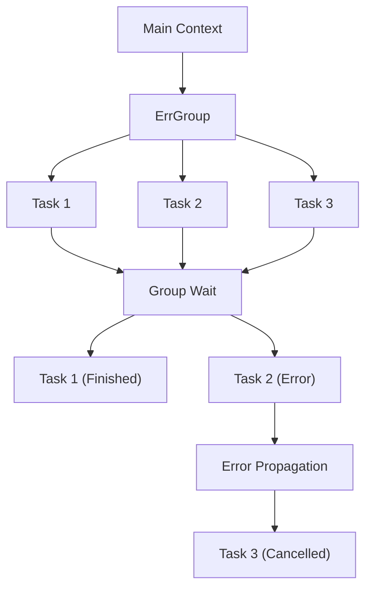

- [errgroup](https://pkg.go.dev/golang.org/x/sync/errgroup)

1. group.Go 内で error を返すとerrgroup がそれを検知
2. 関連するコンテキストがキャンセルされる
    * errgroup.WithContext によって生成されたコンテキストは最初のエラー発生時点でキャンセルされる。
    * ctx.Done() チャネルがすべての関連ゴルーチンに通知される。
3. ゴルーチンが ctx.Done() を確認することでキャンセルを検知

