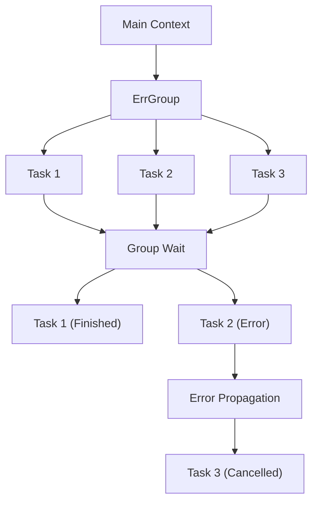

- [errgroup](https://pkg.go.dev/golang.org/x/sync/errgroup)

```mermaid

graph TD
    T1_STEP1["Task 1"]
    T2_STEP1["Task 2"]
    T3_STEP1["Task 3"]
    T1_STEP2["Task 1 (Finished)"]
    T2_STEP2["Task 2 (Error)"]
    T3_STEP2["Task 3 (Cancelled)"]
    E_STEP1["ErrGroup"]
    E_STEP2["Group Wait"]
    E_STEP3["Error Propagation"]

    M["Main Context"]
    M --> E_STEP1
    E_STEP1 --> T1_STEP1 --> E_STEP2 --> T1_STEP2
    E_STEP1 --> T2_STEP1 --> E_STEP2 --> T2_STEP2 --> E_STEP3 --> T3_STEP2
    E_STEP1 --> T3_STEP1 --> E_STEP2
```
